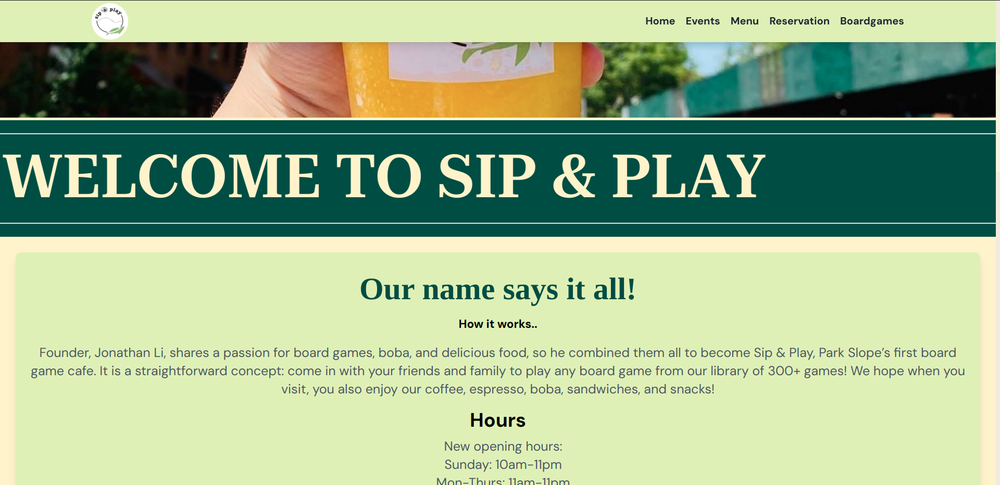
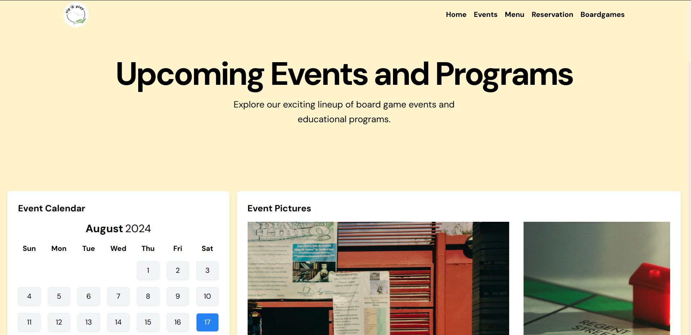
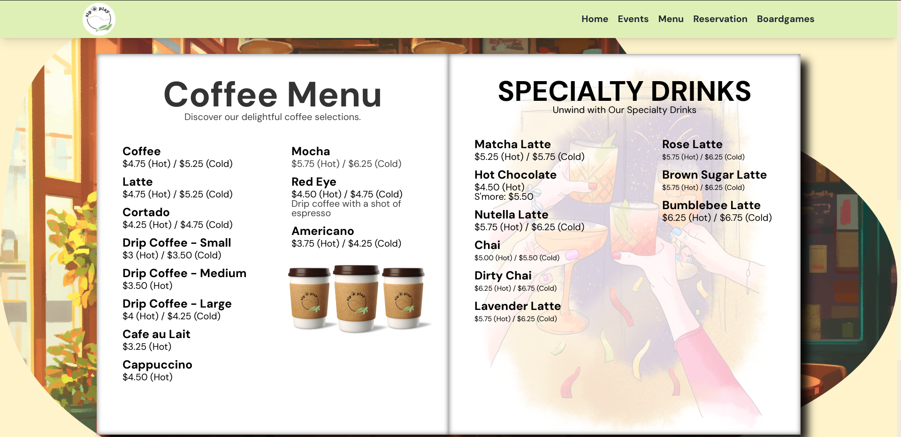
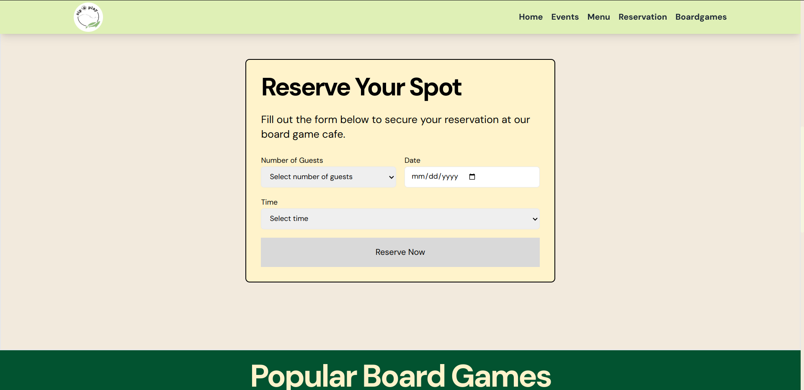
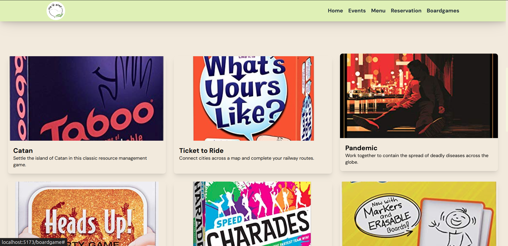

# Sip & Play Café Website

## Overview

Welcome to the Sip & Play Café website! This project was designed to showcase the café’s offerings in a visually engaging manner, meeting the owner's vision and requirements. We used a variety of modern technologies and techniques to create an interactive and dynamic user experience.

## Live Demo

Check out the live website: [Sip & Play Café](https://board-game-cafe.vercel.app/)

## Project Breakdown

### Landing Page

- **Features:** Unique and easy-to-navigate design with Framer Motion animations and image carousels.
- **Major Contributor:** Aditi

### Events

- **Features:** Events calendar with multiple view modes for better organization.
- **Major Contributor:** Ram

### 3D Menu Page

- **Features:** Flipping menu book pages effect for a 3D appearance.
- **Major Contributor:** Anuj

### Reservation Page

- **Features:** Information on reservations and booking options.
- **Major Contributor:** Ram

### Board Games

- **Features:** Enhanced visual effect replacing a plain list of games.
- **Major Contributor:** Ram

## Technologies Used

- **React JS**
- **Vite**
- **JavaScript**
- **HTML**
- **CSS**
- **Framer Motion**

## Contributing

- **Aditi:** Landing Page
- **Ram:** Events
- **Anuj:** 3D Menu Page

Feel free to explore the website and enjoy the interactive features designed to enhance your experience at the Sip & Play Café!
